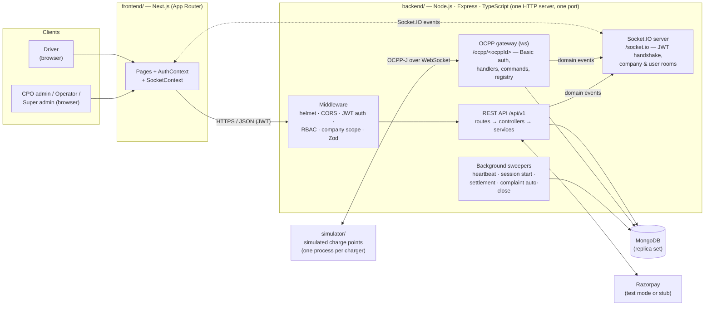
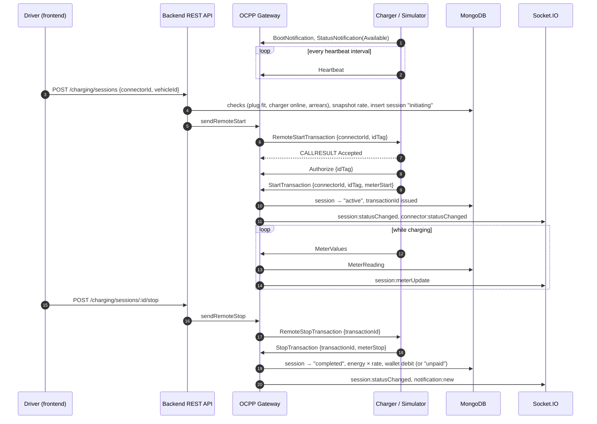

# EV Charging Management System (EV-CMS)

> A multi-tenant Charge Point Management System (CPMS) for running an EV charging network. It manages
> operators, stations, chargers and connectors, talks to chargers in real time over an OCPP 1.6J-style
> WebSocket protocol, and meters, prices and bills each charging session.


---

## Table of contents

- [Project overview](#project-overview)
- [Key features](#key-features)
- [System architecture](#system-architecture)
- [Charging session flow](#charging-session-flow)
- [Tech stack](#tech-stack)
- [Repository layout](#repository-layout)
- [Getting started](#getting-started)
- [Testing](#testing)
- [Demo walkthrough](#demo-walkthrough)
- [API overview](#api-overview)
- [Documentation](#documentation)
- [Known limitations and future scope](#known-limitations-and-future-scope)

---

## Project overview

A **Charge Point Operator (CPO)** owns charging stations. Each station has chargers, and each charger
has one or more connectors (plugs). To run that network, the CPO needs software that knows which
chargers are online, starts and stops charging when a driver asks, records how much energy was
delivered, charges the driver the right amount, and handles support tickets when something goes wrong.
That software is a **Charge Point Management System**, and EV-CMS is one.

**Who uses it.** There are four fixed roles, and every permission check happens on the server:

| Role | Scope | What they do |
|---|---|---|
| `super_admin` | Whole platform | Onboards CPO companies, manages platform-wide resources, reverses recharges |
| `cpo_admin` | Their own company | Manages their company's stations, chargers, connectors, tariffs and staff |
| `operator` | Their own company | Monitors and operates chargers and sessions. Cannot change configuration |
| `driver` | Their own data | Registers vehicles, tops up a wallet, starts and stops their own sessions, files complaints |

**Why OCPP and WebSockets.** Chargers are hardware at remote sites. They open a connection *to* the
backend and must be able to report status and meter readings at any time. The backend in turn must be
able to send commands (start, stop) back down the same connection. A long-lived, bidirectional
WebSocket carrying **OCPP** (Open Charge Point Protocol) messages is the industry-standard way to do
this. EV-CMS follows the OCPP-J wire format: JSON-array `CALL` / `CALLRESULT` / `CALLERROR` frames
correlated by message id. It implements the subset of OCPP 1.6 actions this project needs, with
simplified payloads.

**The system has four parts:**

| Component | Responsibility |
|---|---|
| **Backend** (`backend/`) | REST API, JWT auth and RBAC, business logic, MongoDB access, the OCPP gateway for chargers, and a Socket.IO server that pushes live updates to browsers |
| **Frontend** (`frontend/`) | Next.js web app with an operations console for staff and a charging and wallet app for drivers |
| **Database** | MongoDB via Mongoose. Holds companies, users, stations, chargers, sessions, meter readings, the wallet ledger, complaints and notifications |
| **Simulator** (`simulator/`) | A CLI that behaves like a real charger. Run one process per charger. It connects to the gateway, sends boot, heartbeat, status and meter values, and obeys remote start/stop |

No physical charger is needed. From the backend's point of view, a simulator process is just another
charger.

---

## Key features

### Authentication and authorization
- JWT authentication (`jsonwebtoken`) with passwords hashed using **bcrypt** (`bcryptjs`, configurable salt rounds).
- **Role-based access control** with four roles, enforced by route middleware and again inside service-layer queries.
- **Multi-tenant isolation.** `cpo_admin` and `operator` queries are always filtered by `companyId`, and drivers only see their own records. Cross-tenant access is tested in a dedicated security-matrix suite.
- The user is reloaded from MongoDB on every request, so suspending an account takes effect immediately. JWT claims alone are not trusted.
- Request validation with **Zod** on body, query and params. Standard JSON error envelope.
- `helmet` security headers, a CORS allow-list, and a 1 MB request-body cap.

### Company (CPO) and user management
- `super_admin` creates and manages CPO companies and their staff accounts (`cpo_admin`, `operator`).
- Drivers self-register, manage their profile, and register vehicles with a connector type.
- Suspending a company blocks its staff (`requireActiveCompany` middleware).

### Station management
- Station CRUD with address and latitude/longitude.
- Three statuses: `active`, `inactive` (set by the CPO) and `suspended` (a platform sanction only `super_admin` can set or clear).
- **Station map** built with Leaflet and OpenStreetMap. Staff get a company-scoped map and drivers get a public discovery map.
- **"Stations near me"** for drivers. A MongoDB `$geoNear` query on a `2dsphere` index, with a configurable radius (default 25 km, max 200 km). The driver's position is used for that one query and never stored.

### Charger and connector management
- Chargers have an AC/DC type and a unique **OCPP identity** (`ocppId`). Each has one or more connectors with a plug type (`CCS2`, `CHAdeMO`, `Type2`, `GBT`) and a power rating.
- Impossible configurations are rejected when saved. For example, a DC-only plug (CCS2 or CHAdeMO) cannot go on an AC charger.
- **Per-charger OCPP credentials.** Tokens are stored only as a bcrypt hash, and the plaintext is shown once when issued.
- Four separate status fields, never merged into one:
  - **administrative** `Charger.status`, set by a human.
  - **connectivity** `Charger.isOnline`, whether the WebSocket is up.
  - **self-reported** `Charger.hardwareStatus`, from OCPP `connectorId: 0`.
  - **per-plug** `Connector.status`, from OCPP `StatusNotification`.
- Read-only live diagnostics (`GET /chargers/:id/connection`) show what the gateway is holding in memory right now.

### Charging sessions
- Drivers start a session on a connector. The backend checks the vehicle fits the plug, the charger is online and healthy, and the driver is not over their unpaid-balance limit. Then it sends `RemoteStartTransaction`.
- **Session lifecycle:** `initiating → active → stopping → completed`, with `failed` for start timeouts, rejections, charger disconnects and hardware faults. Each ended session records a stop reason.
- **One open session per connector** is guaranteed by a **partial unique index** in MongoDB, not by application code.
- Sessions stuck in `initiating` are failed by a sweeper after `SESSION_START_TIMEOUT_SECONDS`, which frees the connector.
- If a charger disconnects or stops heartbeating mid-session, the session is failed and the energy recorded up to that point is kept.
- Energy comes from the charger's own meter (`MeterValues` stored as `MeterReading` documents).
- OCPP transaction ids stay unique across backend restarts.

### Tariffs, wallet and payments
- One active **tariff** per company (partial unique index), priced in paise per kWh. The rate is **copied onto the session when it starts**, so a later price change cannot alter the cost of a charge already in progress. All money is stored as integer paise.
- **Driver wallet** with a **ledger** (`WalletTransaction`) that records every credit and debit. Debits are atomic and guarded against overdraw, and payments use MongoDB transactions.
- **Razorpay (test mode)** top-ups with **server-side HMAC signature verification** of both checkout callbacks and webhooks. The webhook signature is checked against the raw request bytes.
- **Stub payment provider** when no Razorpay keys are set. Order creation is faked, but signature verification is still real HMAC.
- **Deferred settlement.** A session that ends while the wallet is short is marked `completed` + `unpaid`. A background sweeper collects it after the next top-up, with retry backoff.
- **Arrears limit.** A new charge is refused once a driver's aged unpaid balance exceeds ₹200 or three sessions.
- `super_admin` can reverse a wallet recharge. This is a ledger reversal inside the platform. It does not call Razorpay's refund API.

### OCPP gateway (charger ↔ backend)
Runs on raw WebSockets (`ws`) at `ws://<host>/ocpp/<ocppId>`, sharing one HTTP server with Express and Socket.IO.

- **Connection authentication** before the WebSocket upgrade. The charger must exist (the gateway never auto-registers hardware), the HTTP Basic username must match the `ocppId` in the path, and the token must match the stored bcrypt hash.
- **Charger → backend actions handled:**

  | Action | What the backend does |
  |---|---|
  | `BootNotification` | Accepts the charger and returns the heartbeat interval |
  | `Heartbeat` | Refreshes liveness |
  | `StatusNotification` | Updates connector status. `connectorId: 0` updates the charger's own hardware status |
  | `Authorize` | Validates the per-session `idTag` |
  | `StartTransaction` | Moves the session to `active` and issues a transaction id |
  | `MeterValues` | Stores meter readings and pushes live energy to dashboards |
  | `StopTransaction` | Finalises energy and cost, completes the session, triggers settlement |

- **Backend → charger commands:** `RemoteStartTransaction` and `RemoteStopTransaction`, with request/response correlation and a 10-second timeout.
- Unknown actions get a `NotSupported` CALLERROR. Malformed frames get a `FormationViolation` CALLERROR, and the socket stays open.
- **Offline detection.** A single sweep timer marks chargers offline after `OCPP_OFFLINE_AFTER_SECONDS` of silence (default 90 s, three missed heartbeats).
- **Reconnects.** A newer connection from the same charger replaces the old socket.
- **Restart safety.** On boot, every charger still marked online is reset, because the in-memory registry starts empty.

### Real-time monitoring (backend → browser)
- A **Socket.IO** server, kept separate from the OCPP channel. The JWT is checked during the handshake.
- Events are sent to per-company and per-user rooms: connector status, charger online/offline, charger hardware status, session status, live meter updates, and new notifications.
- The staff dashboard and live monitor update without polling.

### Support, notifications and analytics
- **Complaints** (driver → CPO). Categories, a starting priority chosen by the system from the category and whether the session failed, and a staff workflow (`open ⇄ in_progress → resolved → closed`). The driver can confirm or reopen a resolved complaint, and a sweeper auto-closes it after 7 days.
- **In-app notifications** for charging started, completed or failed, payments, wallet recharges, complaint updates, new complaints (to staff) and charger hardware faults (to staff). Delivered live over Socket.IO, with an unread count.
- **Analytics** endpoints for overview, sessions, revenue and top stations, over a date range (default 30 days, max 366), scoped by role. Revenue counts money actually collected from charging, not wallet top-ups.
- **Staff console** with a live dashboard (fleet status, active sessions, recent activity) plus management pages for companies, users, stations, chargers, tariffs, sessions, payments and complaints.

---

## System architecture



**Design points visible in the code:**

- **Two real-time channels, kept apart.** Chargers speak OCPP over raw `ws` on `/ocpp/*`. Browsers receive application events over Socket.IO on `/socket.io`. Both are attached to the same `http.Server` created in `server.ts`, but neither knows the other's protocol.
- **Layered backend.** `routes → middlewares → controllers → services → models`. Business rules and ownership checks live in services, so an endpoint cannot skip them.
- **The database enforces invariants where it can.** One open session per connector, one active tariff per company, and unique Razorpay order and payment ids are all partial unique indexes.
- **Single-process by design.** The OCPP connection registry and Socket.IO rooms live in memory. See [Known limitations](#known-limitations-and-future-scope).

---

## Charging session flow

What happens when a driver presses **Start** and later **Stop**:



If the charger never confirms, rejects the start, disconnects, or reports a fault, the session ends as
`failed` with a stop reason. The connector is released either way.

---

## Tech stack

| Layer | Technology |
|---|---|
| Backend runtime | Node.js 20+, TypeScript 5, Express 4 |
| Database | MongoDB (replica set required for transactions), Mongoose 9 |
| Auth and security | `jsonwebtoken`, `bcryptjs`, `helmet`, `cors`, Zod 4 validation |
| Charger channel | `ws` 8, OCPP-J framing (OCPP 1.6J-inspired action subset) |
| Browser real-time | Socket.IO 4 (server + `socket.io-client`) |
| Payments | Razorpay Node SDK (test mode) with a built-in stub provider |
| Frontend | Next.js 16 (App Router), React 19, TypeScript, Tailwind CSS 4 |
| Maps | Leaflet, React Leaflet, OpenStreetMap tiles |
| Simulator | TypeScript CLI (`tsx`) using `ws` |
| Tooling | ESLint 9 + `typescript-eslint`, `tsx` watch mode, `morgan` request logs |
| Testing | Node.js check scripts (`tests/api`) and Playwright browser scripts (`tests/browser`) |

**Not used on purpose:** Redis, Kafka, Docker/Kubernetes, multi-region deployment.

---

## Repository layout

```
EV-CMS/
├── backend/
│   └── src/
│       ├── config/        env loading, MongoDB connection
│       ├── constants/     roles, status enums, limits (single source of truth)
│       ├── routes/        one router per module, mounted under /api/v1
│       ├── middlewares/   auth, role, company scope, validation, errors
│       ├── controllers/   HTTP ↔ service translation
│       ├── services/      business logic and ownership checks
│       ├── models/        Mongoose schemas and indexes
│       ├── validators/    Zod schemas
│       ├── ocpp/          gateway, message framing, handlers, outbound commands, registry
│       ├── realtime/      Socket.IO server, handshake auth, rooms, publisher
│       ├── payments/      Razorpay provider + stub
│       ├── scripts/       seed data and one-time data repair scripts
│       └── utils/         JWT, money, logging, scoping helpers
├── frontend/
│   └── src/
│       ├── app/           Next.js routes (dashboard, monitor, map, stations, chargers,
│       │                  sessions, wallet, payments, complaints, analytics, …)
│       ├── components/    layout, dashboard widgets, charts, map, forms
│       ├── context/       AuthContext, SocketContext
│       └── services/      typed API client per module
├── simulator/
│   └── src/               simulated charge point (config, OCPP messages, charger state machine)
├── tests/
│   ├── api/               24 API check suites
│   ├── browser/           2 Playwright browser suites
│   └── run.mjs            runner with expected per-suite counts
└── docs/design/           design note per subsystem + API reference
```

---

## Getting started

### Prerequisites

- **Node.js 20+** and npm
- **MongoDB**, local or Atlas. It **must be a replica set**, because wallet and payment operations use
  multi-document transactions. Atlas clusters are replica sets by default. A local `mongod` needs `--replSet`.

### 1. Install

```bash
git clone <repo-url> EV-CMS && cd EV-CMS

cd backend   && npm install
cd ../frontend  && npm install
cd ../simulator && npm install
```

### 2. Configure

```bash
cd backend && cp .env.example .env
```

| Variable | Required | Purpose |
|---|---|---|
| `MONGODB_URI` | ✅ | Connection string ending in a database name. The API starts without it, but only `/health` works |
| `JWT_SECRET` | ✅ | Token signing key. Rotating it invalidates every issued token |
| `PORT` | | Default `5000` |
| `API_PREFIX` | | Default `/api/v1` |
| `CORS_ORIGIN` | | Default `http://localhost:3000`. Comma-separated for more than one |
| `JWT_EXPIRES_IN` | | Default `7d` |
| `BCRYPT_SALT_ROUNDS` | | Default `10` |
| `OCPP_OFFLINE_AFTER_SECONDS` | | Default `90`. Use `5` when running the tests |
| `SESSION_START_TIMEOUT_SECONDS` | | Default `20` |
| `RAZORPAY_KEY_ID` / `RAZORPAY_KEY_SECRET` | | **Leave empty** to use the stub provider. Test-mode keys only |
| `RAZORPAY_WEBHOOK_SECRET` | | Only if you configure a Razorpay webhook |

Create `frontend/.env.local`:

```
NEXT_PUBLIC_API_BASE_URL=http://localhost:5000/api/v1
```

> `.env` files are git-ignored and must stay that way. Never put live-mode Razorpay credentials in them.

### 3. Seed demo data

```bash
cd backend
npm run seed:admin      # the platform super_admin
npm run seed:demo       # companies, tariffs, stations, chargers, connectors, staff
npm run seed:activity   # drivers, vehicles, ~3 weeks of sessions, meter readings, payments, complaints
```

`seed:activity` goes through the real tariff and ledger code, so dashboards and analytics show realistic data.
Seeded drivers can end up owing money, which blocks new charges. To clear that through the real settlement path:

```bash
npm run fix:arrears              # dry run: report who owes what
npm run fix:arrears -- --apply   # credit wallets and settle through the ledger
```

One-time data repair scripts, all dry-run unless given `--apply`:

| Script | Use |
|---|---|
| `fix:settlement-backoff` | Adds retry-backoff fields to payment records created before backoff existed |
| `fix:station-location` | Adds the GeoJSON `location` field to stations created before "near me" existed |
| `fix:session-hardware` | Copies AC/DC and plug type onto sessions created before those fields existed |

### 4. Run: three terminals

```bash
# Terminal 1 — backend (REST + OCPP gateway + Socket.IO on :5000)
cd backend && npm run dev

# Terminal 2 — frontend (http://localhost:3000)
cd frontend && npm run dev

# Terminal 3 — one simulated charger per process (flags need "=")
cd simulator && npm run dev -- --charger=LIV-DEL-CP-01-A --token=<authToken>
```

Get a charger token from the charger page, or with `POST /api/v1/chargers/:chargerId/token` as `super_admin` or
`cpo_admin`. The plaintext is returned **once**. Optional simulator flags: `--url`, `--connector`,
`--meterInterval`, `--powerKw`, `--reconnectDelay`. Environment variables such as `CHARGER_OCPP_ID` and
`CHARGER_AUTH_TOKEN` also work.

While the simulator is running, type a key to inject a fault:

| Key | Effect |
|---|---|
| `f` | Connector fault. `StatusNotification` on `connectorId 1` |
| `m` | Charger (machine) fault. `StatusNotification` on `connectorId 0` |
| `c` | Clear faults |

### Demo logins

Weak passwords on purpose. Never use this data in production.

| Role | Email | Password |
|---|---|---|
| super_admin | `admin@evcms.local` | `Admin@12345` |
| cpo_admin | `cpo@livanto.local` | `Cpo@12345` |
| operator | `ops@livanto.local` | `Ops@12345` |
| cpo_admin (second CPO) | `cpo@sharma.local` | `Cpo@12345` |
| driver | `ananya@driver.local` | `Driver@12345` |

---

## Testing

The test suite is **executable check scripts**, not a unit-test framework. They run against a **real backend, a
real MongoDB, real OCPP WebSocket frames and real HMAC signatures**, with nothing mocked. The runner keeps an
expected count for every suite, so a check that silently disappears shows up as drift.

| Suite group | Checks |
|---|---|
| API: 24 suites (foundation, auth, company, user, station, charger, OCPP, faults, sessions, realtime, tariffs, wallet, arrears, settlement race, complaints, notifications, analytics, map, dashboard, security matrix, integrity, failure modes, …) | 1,480 expected |
| Browser: 2 Playwright suites (map UI, dashboard UI with a live OCPP session) | 104 expected |

```bash
# Server terminal — a short offline threshold so the OCPP timeout checks finish quickly
cd backend && OCPP_OFFLINE_AFTER_SECONDS=5 npm run dev
```

```bash
cd backend
npm run build        # required: some suites import compiled output
npm test             # all API suites
npm test auth wallet # selected suites
npm run test:list    # suites and their expected counts
npm run test:clean   # remove test data
```

Static checks in each package (`backend/`, `frontend/`, `simulator/`):

```bash
npm run typecheck && npm run lint
```

See [`tests/README.md`](tests/README.md) for the browser suites and the Razorpay-keys caveat.

---

## Demo walkthrough

1. Sign in as **`cpo@livanto.local`**. The operations dashboard shows fleet status, active sessions, revenue and open complaints.
2. **Start a simulator** for one of that CPO's chargers. It appears online on the dashboard without a page refresh.
3. In another browser window, sign in as the **driver**, open **Wallet** and top up ₹500 (stub or Razorpay test mode).
4. **Start charging.** The connector changes to *charging*, the session appears, and energy climbs live on the admin dashboard.
5. **Stop.** The cost is calculated on the server from metered energy × the rate copied at start (e.g. 2.5 kWh × ₹12.00/kWh = ₹30.00) and debited from the wallet.
6. **Try an empty wallet.** Energy is still delivered, and the session ends `completed` + `unpaid`. A later top-up settles it automatically. Past the arrears limit, new starts are refused with the amount owed.
7. Press **`m`** in the simulator. The charger reports a machine fault, staff get a `charger_fault` notification, and new starts on that charger are refused.
8. **File a complaint** as the driver, resolve it as staff, and watch the notification arrive. Then look at **Analytics** and the **Station map** (including *Stations near me* as the driver).

---

## API overview

All endpoints are under `/api/v1`. Every endpoint except `auth/register`, `auth/login`, `health`, and the Razorpay
webhook requires a JWT. The full reference, with roles per endpoint, is in [`docs/design/API.md`](docs/design/API.md).

| Area | Base path | Highlights |
|---|---|---|
| Health | `/health` | Liveness + database state |
| Auth | `/auth` | `register`, `login`, `me` |
| Companies | `/companies` | CPO CRUD, status, company staff |
| Users & vehicles | `/users` | Profile, `me/vehicles` CRUD, staff management |
| Stations | `/stations` | CRUD, status, `map` (staff), `public` (driver discovery / near me) |
| Chargers & connectors | `/chargers` | CRUD, status, connectors, OCPP token, live connection state |
| Charging | `/charging` | Connector availability, start / stop / list sessions, meter readings |
| Tariffs | `/tariffs` | CRUD, activation |
| Wallet | `/wallet` | Balance, ledger, recharge order + verify |
| Payments | `/payments` | List, detail, recharge reversal, Razorpay webhook |
| Complaints | `/complaints` | Create, list, staff status updates, driver confirm / reopen |
| Notifications | `/notifications` | List, unread count, mark read |
| Analytics | `/analytics` | `overview`, `sessions`, `revenue`, `stations` |

The OCPP endpoint is `ws://localhost:5000/ocpp/<ocppId>`, authenticated with HTTP Basic `<ocppId>:<token>`.

---

## Documentation

Each subsystem has a design note in [`docs/design/`](docs/design) covering what it does and the decisions behind it:

| | | |
|---|---|---|
| [Foundation](docs/design/foundation.md) | [Auth & RBAC](docs/design/auth-and-rbac.md) | [Companies & tenancy](docs/design/companies-and-tenancy.md) |
| [Users & vehicles](docs/design/users-and-vehicles.md) | [Stations](docs/design/stations.md) | [Chargers & connectors](docs/design/chargers-and-connectors.md) |
| [OCPP gateway](docs/design/ocpp-gateway.md) | [Charging sessions](docs/design/charging-sessions.md) | [Real-time monitoring](docs/design/realtime-monitoring.md) |
| [Tariffs & pricing](docs/design/tariffs-and-pricing.md) | [Wallet & payments](docs/design/wallet-and-payments.md) | [Support & complaints](docs/design/support-and-complaints.md) |
| [Notifications](docs/design/notifications.md) | [Analytics](docs/design/analytics.md) | [Station map](docs/design/station-map.md) |
| [Admin console](docs/design/admin-console.md) | [API reference](docs/design/API.md) | [Tests](tests/README.md) |

---

## Known limitations and future scope

Each of these was a deliberate scope decision. They are the obvious next steps for the project.

**Scale and infrastructure**
- **Single backend instance only.** The OCPP connection registry and Socket.IO rooms are in memory. *Future:* Redis-backed registry and the Socket.IO Redis adapter.
- **No API rate limiting.**
- **No JWT revocation list.** Suspension takes effect immediately through the per-request user reload, but a stolen token stays valid until it expires.
- **`MeterReading` grows without limit.** No TTL or rollup yet.
- No containerisation or deployment configuration. The project runs as a local three-process setup.

**Protocol**
- **OCPP 1.6J-inspired, not certified.** The frame envelope and action names follow the spec, but payloads are simplified. Only the 7 inbound actions and 2 outbound commands listed above are implemented. *Not implemented:* reservations, smart charging, `ChangeConfiguration`, firmware and diagnostics, local auth lists, OCPP 2.0.1.
- **OCPI (roaming between operators) is not implemented.** It is conceptual only.

**Money**
- Razorpay **test mode only**. The platform collects payments but never pays out to operators.
- A recharge reversal is a ledger entry only. No refund is sent to Razorpay.
- Revenue is counted when money is collected, not when it is earned.
- There is no write-off policy for bad debt. Arrears thresholds (₹200 / three sessions) are the same for everyone, with no per-operator or per-driver override.

**Product features not built**
- No charger utilisation metric, period-over-period comparison, or CSV/PDF export.
- No map clustering and no live-updating map markers.
- No charger-offline notifications. Offline status shows on the live dashboard, and hardware faults do send notifications.
- Notifications are in-app only. No email, SMS, push or user preferences.
- Complaints have no assignment, SLA or attachments.
- The driver home page has not had the visual polish pass the staff console received.

**Testing**
- Integration-style check scripts, not unit tests. Code coverage is not measured.
- Browser checks are selective. Layout and visual polish are reviewed by eye.
